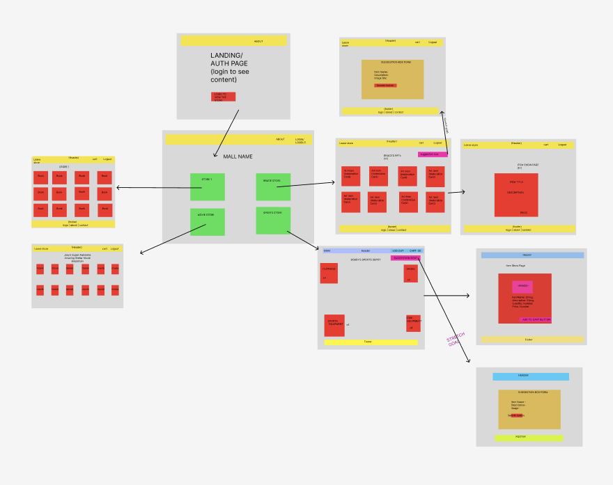
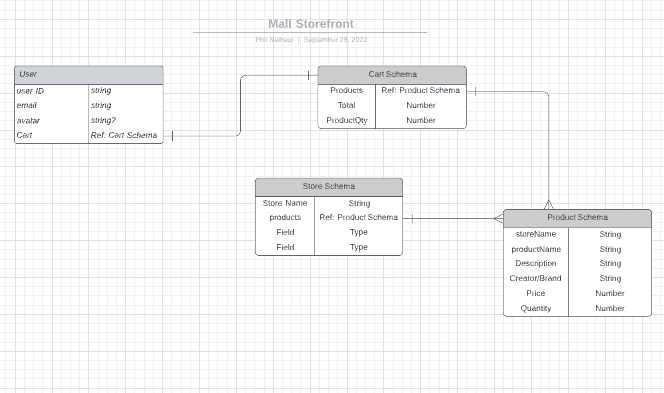

# **VIRTUAL MALL**

## **A better way to shop**

---
## 🛒 **DESCRIPTION** 🛒

### *Let's face it:*
Regular malls just don't cut it for some shoppers. It may be out of the way, only to find out the store doesn't have the item or size you want. Online shopping offers three not-so-great alternatives: 

- Amazon: thousands of off brands from another country claiming to be the best (with "authentic" and generic 5-star reviews). Your shopping experience is varied.
- Top Brand Stores: each with their own website and user experience, leaves the user's browswer cluttered while they find the right items. 
- 3rd party hosting sites: riddled with ads and popups

### **Meet VIRTUAL MALL**
An online shopping experience for users to enjoy! Designed for top brands to host their products for users. 
- Each brand gets their own space to host and sell
- The user has only one site they need to worry about
- Our Virtual Mall has plenty of space for new brands to add their store. 
- We make it easy to add new products! 

---

## ➡️ **GETTING STARTED** ⬅️
Please visit this link for the full web app!
https://virtualmallusa.netlify.app/

Backend GitHub: https://github.com/pneibaur/Virtual-Mall-Backend

---

## 💻 **TECHNOLOGIES** 💻

 
  
  
  
  
  
  
  
  
  
  
  
   

---

## 🧊 **ICEBOX** 🧊

Virtual Mall is a work in progress! We are planning on implementing the following features in the future: 
- login/logout via Google OAuth
- Users will be able to add and remove items from their cart
- Users will be able to see their total and checkout with their items
- Users will be able to make suggestions to stores to add new products
- For admins, they will be able to add/edit/delete products from their store. 
- Mall Admins will be able to add/edit/delete stores. 

---

## 🖼️ **SCREENSHOTS** 🖼️
Welcome Page:

Stores Display:

Products Display: 

Item Viewer: 

---

## **WIREFRAMES**

Wireframes: 

ERD: 

